# NeopixelMatrixTool 视频图像取模工具 v1.0.1 使用说明

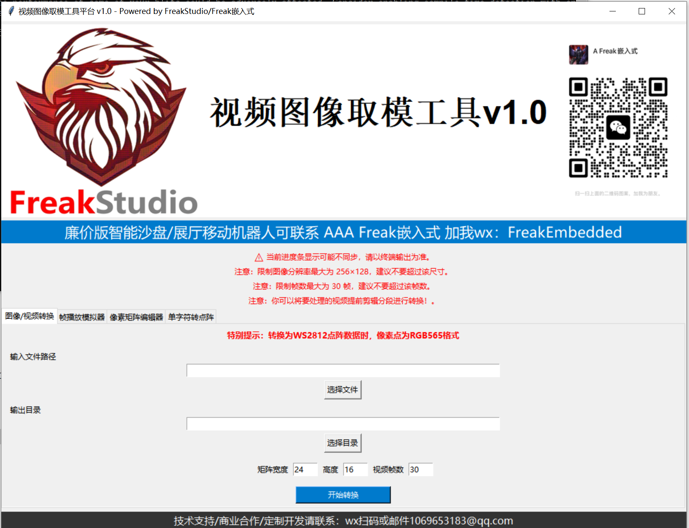

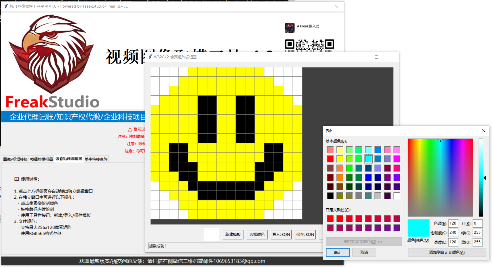

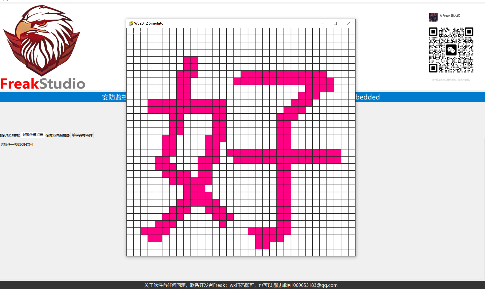

# 一、软件功能概述

`NeopixelMatrixTool` 是一款面向 `WS2812` 像素矩阵的工具集，支持将图像、视频、单字符转换为 `WS2812` 兼容的 `RGB565` 格式点阵 `JSON` 数据，并提供**可视化编辑**、**仿真播放**等功能，同时支持 `GUI`（图形界面）和 `CLI`（命令行）两种操作方式，适用于嵌入式 WS2812 矩阵的点阵数据生成与调试。

核心功能包括：

- **数据转换**：将图像（`JPG`/`PNG`/`BMP` 等）、单字符（中文 / 英文 / 数字）转换为 `RGB565` 格式的点阵 `JSON` 数据（输出至 `out/` 目录）；将视频（`MP4`/`AVI`/`MOV` 等）转换为多帧 `RGB565` 格式的点阵 `JSON` 数据（输出至 `output/` 目录），支持颜色（亮度 / 对比度 / 饱和度）调整。
- **可视化编辑**：提供像素矩阵编辑器，支持鼠标点击 / 拖拽绘制像素、`JSON` 数据导入 / 导出、撤销操作，支持自定义点阵尺寸。
- **仿真播放**：基于 `Pygame` 实现点阵 `JSON` 帧数据的仿真播放，支持暂停 / 继续、帧切换、帧率调整。
- **双界面支持**：`GUI` 界面可视化操作，`CLI` 界面支持批量处理与自动化脚本调用。

# 二、文件夹结构

```
NeopixelMatrixTool/
├── assets/                  # 资源文件目录（存放Logo、字体、二维码、图标等）
├── build/                   # PyInstaller 打包临时目录（打包后可删除）
├── dist/                    # PyInstaller 打包输出目录（onedir 方式产物）
├── docs/                    # 文档资源目录（存放README文档引用的图片等）
├── out/                     # 点阵数据输出目录（图片/单字符转点阵的JSON文件）
├── output/                  # 视频转点阵输出目录（视频转换的多帧JSON文件）
├── ws_converter/            # 核心功能模块包（所有业务逻辑实现）
│   ├── __init__.py          # 包标识文件（空文件即可）
│   ├── char_converter.py    # 单字符转点阵 JSON 功能
│   ├── converter.py         # 图像/视频转点阵 JSON 核心逻辑
│   ├── editor.py            # 像素矩阵可视化编辑器（Tkinter 实现）
│   └── simulator.py         # 点阵数据仿真播放器（Pygame 实现）
├── cli_app.py               # 命令行工具入口脚本
├── gui_app.py               # GUI 工具入口脚本
├── NeopixelMatrixTool.ico   # 应用程序图标（Windows 平台）
├── NeopixelMatrixTool_v1.0.spec # PyInstaller 打包配置文件
├── requirements.txt         # 项目依赖库清单
├── README.md                # 项目说明文档（主文档）
└── LICENSE                  # 开源协议文件
```

- `assets/simhei.ttf`：中文字体文件，解决单字符转点阵时的中文显示问题；
- `docs/`：专门存放 `README` 文档中引用的图片等静态资源，保证文档的完整性和可读性；
- `out/`：专门存储**图片转换**和**单字符转换**生成的点阵 `JSON` 文件，单个文件对应单个图像 / 字符；
- `output/`：专门存储**视频转换**生成的多帧点阵 `JSON` 文件，多个文件对应视频的不同帧；
- `ws_converter/`：核心功能模块，所有转换、编辑、仿真逻辑均在此目录下；
- `NeopixelMatrixTool_v1.0.spec`：`PyInstaller` 打包配置文件，定义打包规则与资源引入；
- `requirements.txt`：一键安装所有依赖库的清单文件。

# 三、依赖环境

推荐使用 **Python 3.12.0**（低版本如 3.9+/3.10+/3.11+ 也可兼容，避免 3.8 及以下版本）。

项目依赖的第三方库如下，所有库均可通过 `pip` 安装：

在项目根目录执行以下命令，一键安装所有依赖：

```
pip install -r requirements.txt
```

# 四、打包方式

本项目采用 **PyInstaller** 作为打包工具，默认使用 **onedir****（单目录）** 方式打包，以下是详细说明：

打包前需要进行下面工作：

1. 安装 `PyInstaller`：`pip install pyinstaller`；
2. 确认 `NeopixelMatrixTool_v1.0.spec` 文件中配置正确（如资源路径、图标路径，若需打包 `docs/` 目录，可在 `datas` 中添加对应配置）。

在项目根目录执行以下命令，分别打包 `GUI` 和 `CLI` 工具：

```
# 打包 GUI 工具（onedir 方式）
pyinstaller NeopixelMatrixTool_v1.0.spec

# 打包 CLI 工具（若有独立 spec 文件）
pyinstaller cli_build.spec
```

打包完成后，产物会生成在 `dist/` 目录下，如 `dist/NeopixelMatrixTool_v1.0/`，其中包含可执行文件（`gui_app.exe`/`cli_app.exe`）和所有依赖文件。


注意，下面的 `exe` 文件需要和 `_internal` 文件夹放到一起才可以执行：


# 五、使用说明

## 5.1 GUI 工具

我们可以用两种方式运行：

- **源码运行**：直接执行 `python gui_app.py`；
- **打包后运行**：双击 `dist/NeopixelMatrixTool_v1.0/gui_app.exe`（Windows 平台）。

### 5.1.1 **图像转点阵**

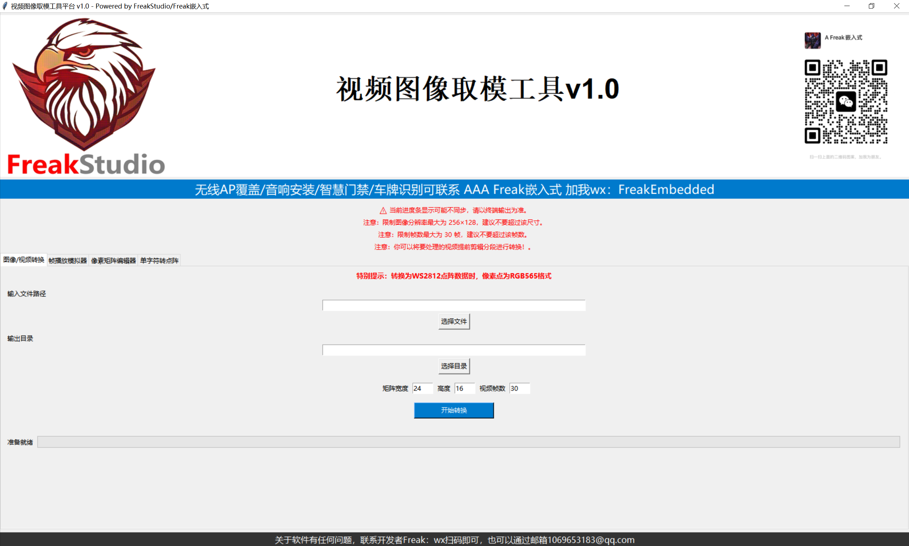

步骤如下：

1. 选择输入图片；
2. 选择输出目录（默认 `out/`）；
3. 设置点阵宽度 / 高度；
4. 点击 “开始转换”，生成的 JSON 文件会保存至 `out/`。

这里，我们以 `G:\NeopixelMatrixTool` 文件夹中，`test_img.png` 为例，进行演示，原图如下：


首先，选择该图片：

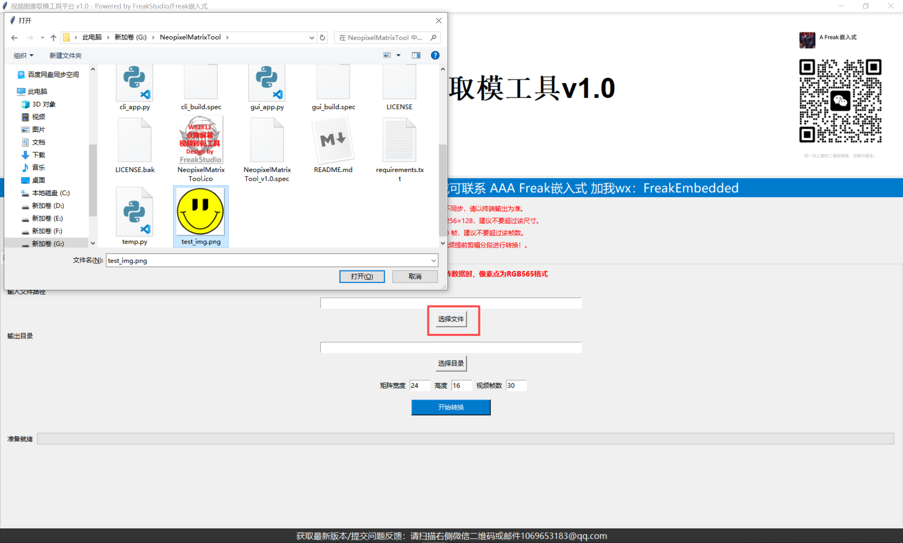

接着选择输出目录：

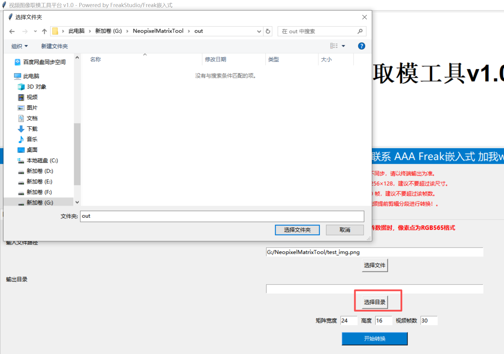

设置尺寸为 `16 x 16`：

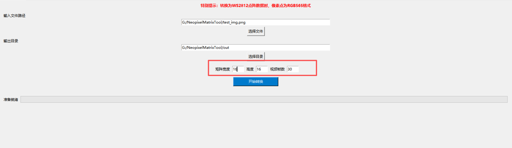

点击开始转换：

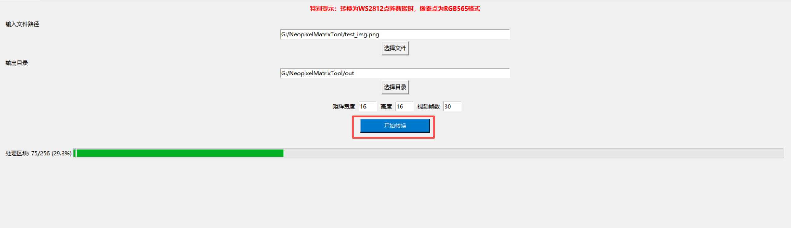

等待转换完成：


进入输出文件夹，点击对应 `json` 文件（和图片同名）：

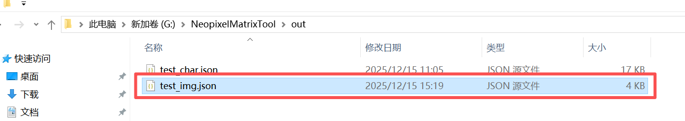

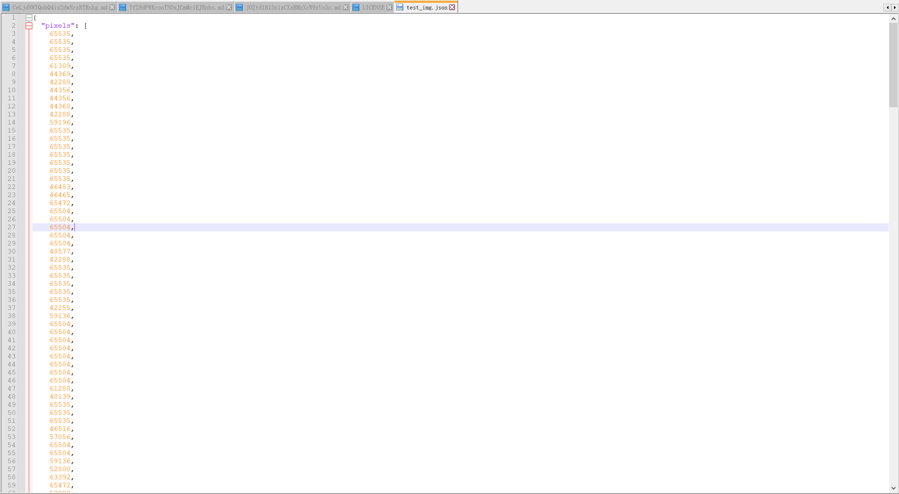

内容如下：

```json
{
  "pixels": [
    65535,
    65535,
    65535,
    65535,
    61309,
    44369,
    42280,
    44356,
    44356,
    44360,
    42288,
    59196,
    65535,
    65535,
    65535,
    65535,
    65535,
    65535,
    65535,
    46483,
    46465,
    65472,
    65504,
    65504,
    65504,
    65504,
    65504,
    48577,
    42288,
    65535,
    65535,
    65535,
    65535,
    65535,
    42255,
    59136,
    65504,
    65504,
    65504,
    65504,
    65504,
    65504,
    65504,
    65504,
    61280,
    40139,
    65535,
    65535,
    65535,
    46516,
    57056,
    65504,
    65504,
    59136,
    52800,
    63392,
    65472,
    52800,
    57024,
    65504,
    65504,
    61280,
    42289,
    65535,
    63422,
    42275,
    65504,
    65504,
    65504,
    27488,
    0,
    54912,
    61280,
    0,
    19040,
    65504,
    65504,
    65504,
    46497,
    59196,
    46484,
    63360,
    65504,
    65504,
    65504,
    27488,
    0,
    54912,
    61280,
    0,
    19040,
    65504,
    65504,
    65504,
    65504,
    42289,
    44364,
    65504,
    65504,
    65504,
    65504,
    27488,
    0,
    54944,
    61280,
    0,
    21120,
    65504,
    65504,
    65504,
    65504,
    44360,
    44360,
    65504,
    65504,
    65472,
    65504,
    38048,
    29568,
    65504,
    63360,
    19008,
    50688,
    65504,
    65504,
    65472,
    65504,
    44356,
    44360,
    52800,
    31680,
    63360,
    65504,
    65504,
    65504,
    65504,
    65504,
    65504,
    65504,
    65504,
    65472,
    31680,
    48608,
    44356,
    44364,
    65504,
    44352,
    63392,
    65504,
    65504,
    65504,
    65504,
    65504,
    65504,
    65504,
    65504,
    65504,
    42240,
    65504,
    44360,
    46484,
    63360,
    63392,
    44352,
    65504,
    65504,
    65504,
    65504,
    65504,
    65504,
    65504,
    65504,
    46496,
    59168,
    65504,
    42289,
    63422,
    42275,
    65504,
    48576,
    57056,
    65504,
    65504,
    65504,
    65504,
    65504,
    65504,
    61248,
    44352,
    65504,
    46497,
    59196,
    65535,
    46516,
    57056,
    65504,
    42272,
    57056,
    65504,
    65504,
    65504,
    65504,
    61248,
    40128,
    65504,
    61280,
    42288,
    65535,
    65535,
    65535,
    42255,
    59136,
    65504,
    46496,
    42240,
    50720,
    52800,
    42272,
    44352,
    65504,
    61280,
    38059,
    65535,
    65535,
    65535,
    65535,
    65535,
    44403,
    46465,
    65472,
    65504,
    59168,
    59136,
    65504,
    65504,
    48577,
    42288,
    65535,
    65535,
    65535,
    65535,
    65535,
    65535,
    65535,
    61309,
    42289,
    42280,
    44356,
    44356,
    44360,
    42288,
    59164,
    65535,
    65535,
    65535,
    65535
  ],
  "width": 16,
  "height": 16,
  "description": "",
  "version": 1.0
}
```

生成后的 `JSON` 文件，使用帧播放器显示如下：

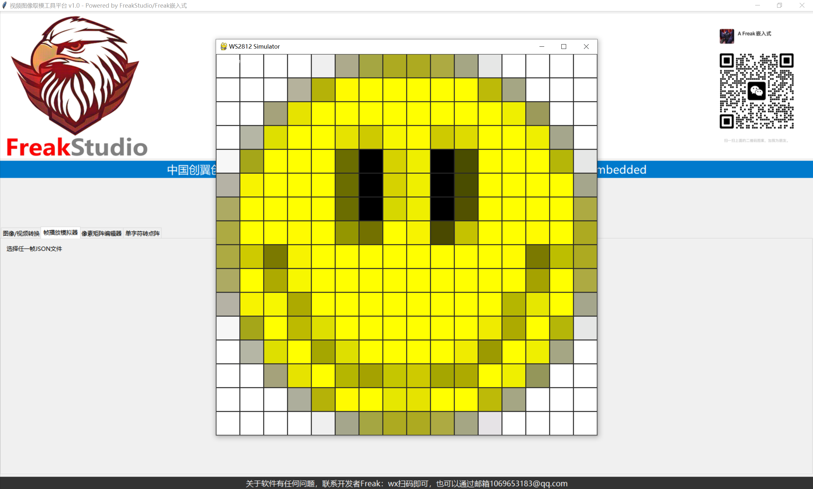

### 5.1.2 **视频转点阵**

和上面步骤类似，下面是我们测试用的 `mp4` 文件（文件夹中的 `test_video.mp4`）：


步骤如下：

1. 选择输入图片；
2. 选择输出目录（默认 `output/`）；
3. 设置点阵宽度 / 高度和抽取帧数；
4. 点击 “开始转换”，生成的 JSON 文件会保存至 `out/`。

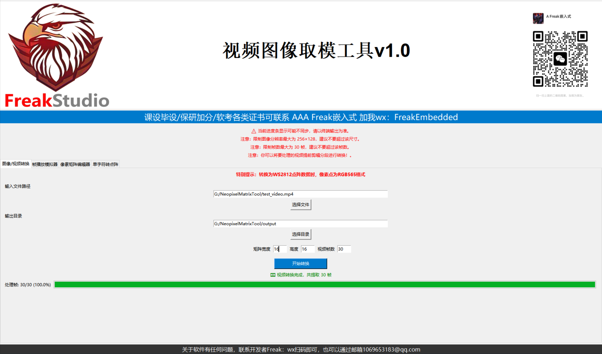

接下来，我们可以去生成文件夹中查看：

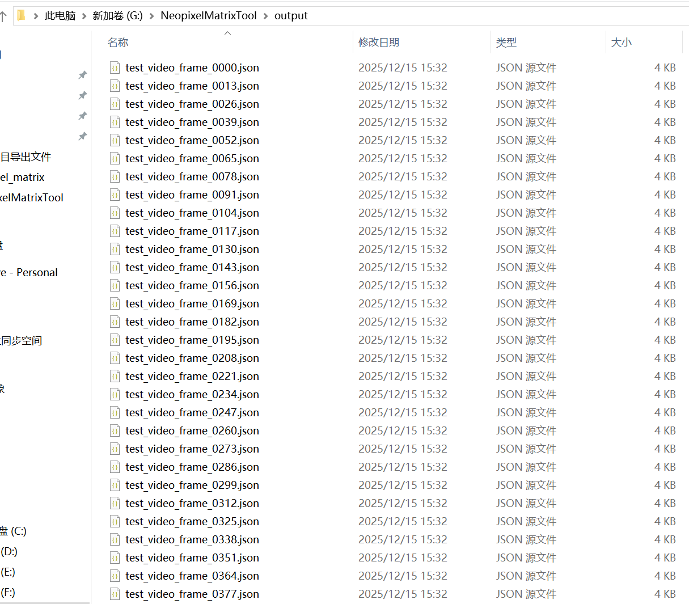

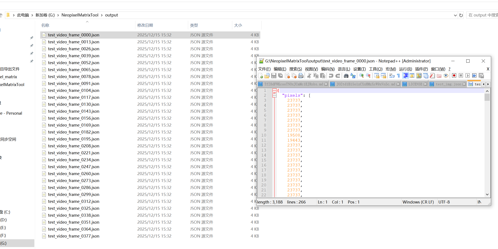

视频转换后输出至 `output/` 目录的 JSON 文件，命名遵循统一格式：

```
[原视频文件名]_frame_[四位补零帧序号].json
```

其中：

- `[原视频文件名]`：与输入的视频文件名称保持一致（不含后缀），例如输入视频为 `test_video.mp4`，则此处为 `test_video`；
- _frame_：固定标识符，用于明确该文件是视频帧对应的点阵数据；
- `[四位补零帧序号]`：视频帧的顺序编号，从 `0000` 开始递增，不足 4 位时自动补前导零（例如第 3 帧对应 `0003`、第 12 帧对应 `0012`）；
- `.json`：固定文件后缀，标识为 `JSON` 格式的点阵数据文件。

随机选择一个生成后的 `JSON` 文件，使用帧播放器显示如下：


### 5.1.3 **单字符转点阵**

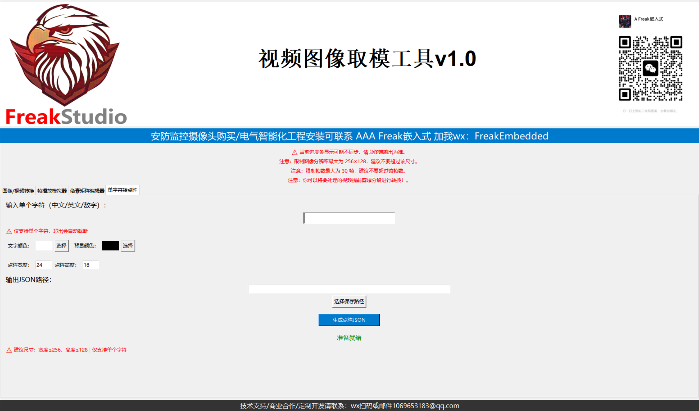

步骤如下：

1. 输入单个字符
2. 选择文字 / 背景颜色
3. 设置点阵尺寸
4. 选择输出路径（默认 `out/`）
5. 点击 “生成点阵 JSON”，文件保存至 `out/`

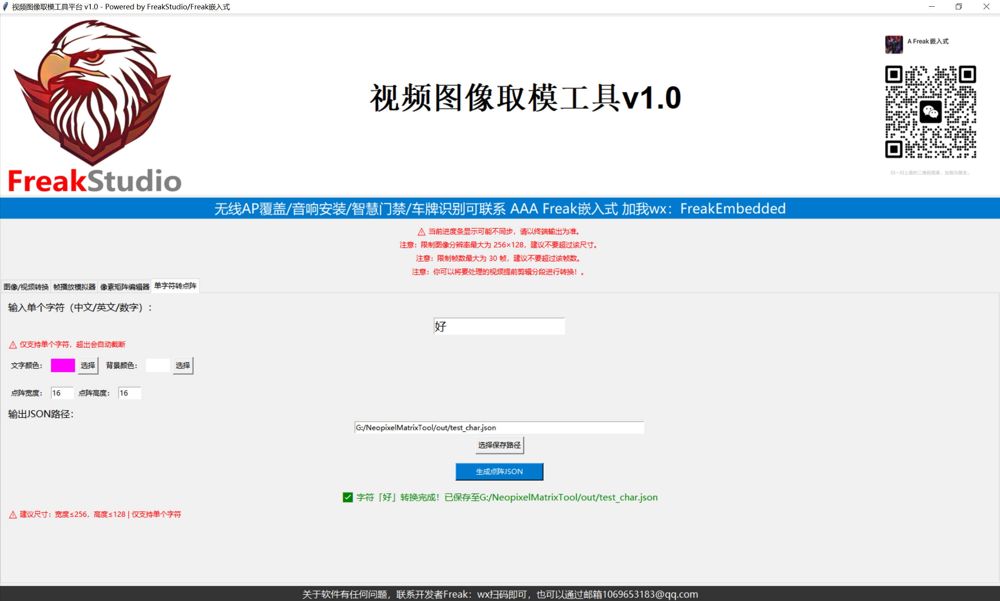

生成后的 `JSON` 文件，使用帧播放器显示如下：


### 5.1.4 **帧播放模拟器**

步骤如下：

- 选择 `output/` 目录下任一视频帧 `JSON` 文件；
- 自动读取点阵尺寸；
- 点击 “播放”（空格键暂停 / 继续，方向键切换帧）。

也可选择 `out/` 目录下的图片 / 字符 `JSON` 文件进行单帧预览。

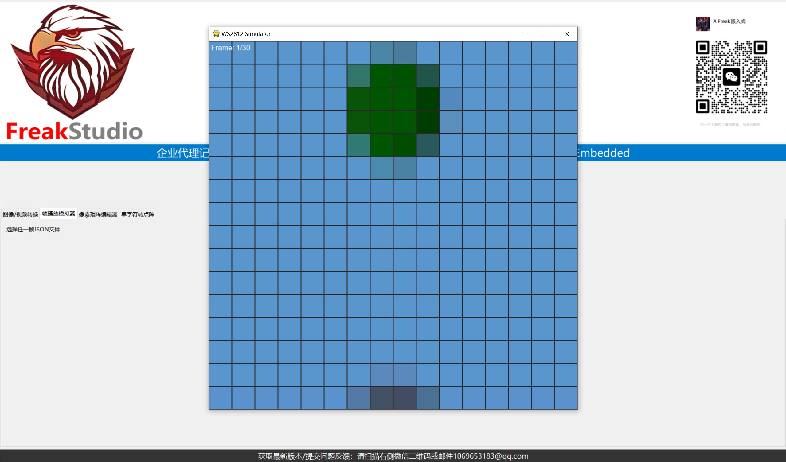

按下左右按键即可切换帧：

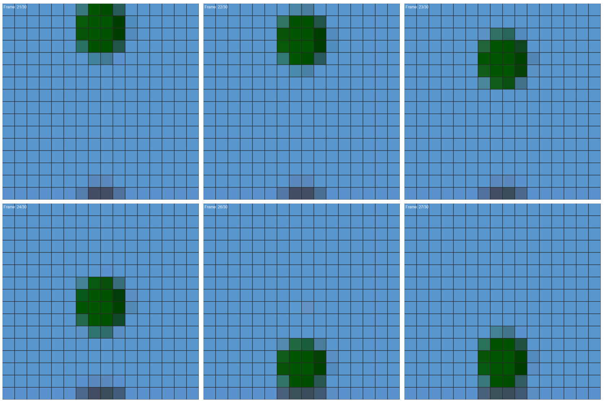

### 5.1.5 **像素矩阵编辑器**

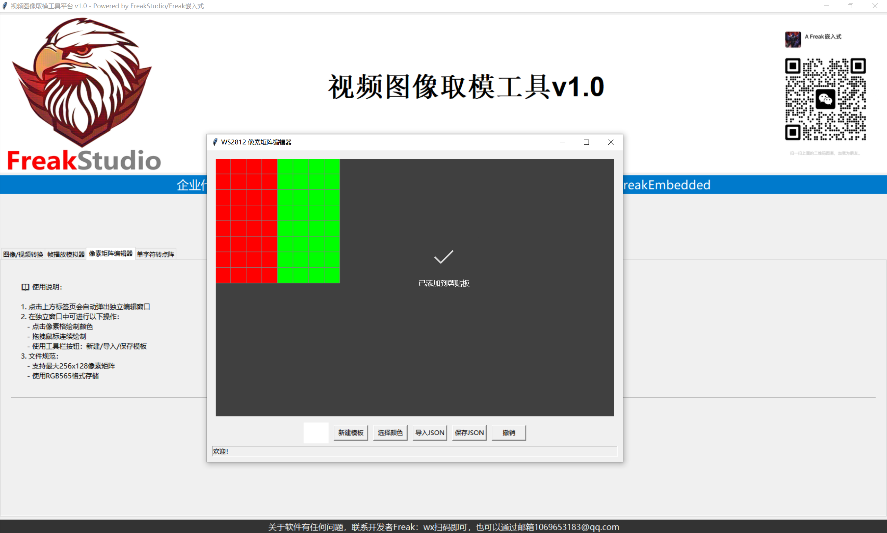

使用步骤如下：

1. 点击 “像素矩阵编辑器” 标签页；
2. 弹出编辑窗口；
3. 可绘制像素、导入 / 导出 JSON、选择颜色。

我们可以创建一个指定大小的空白模板进行编辑：

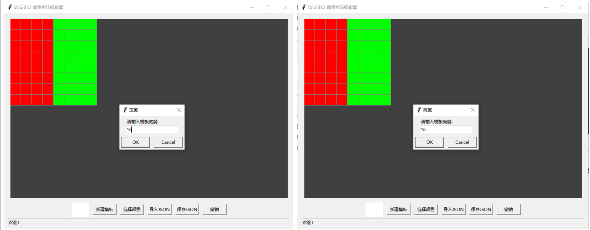


点击选择颜色，即可进行编辑：

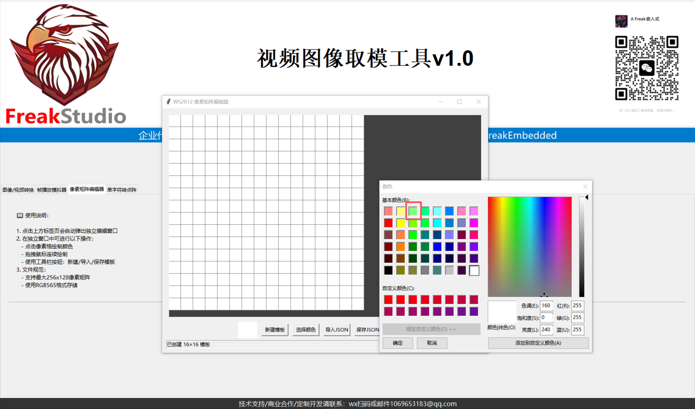

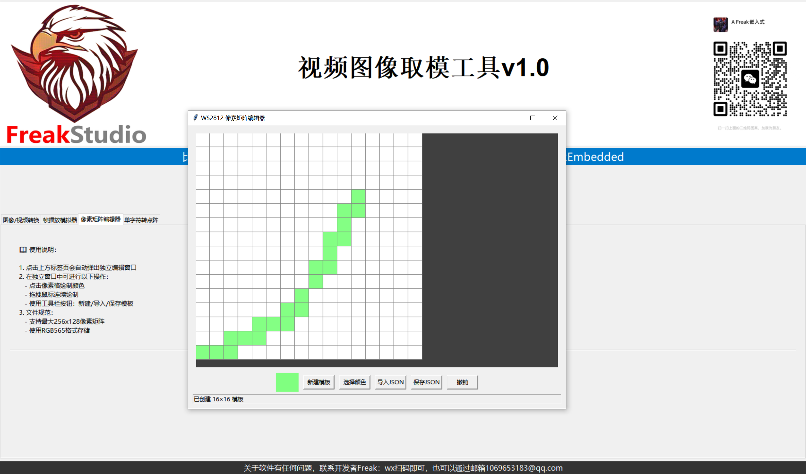

我们也可以选择撤销操作：

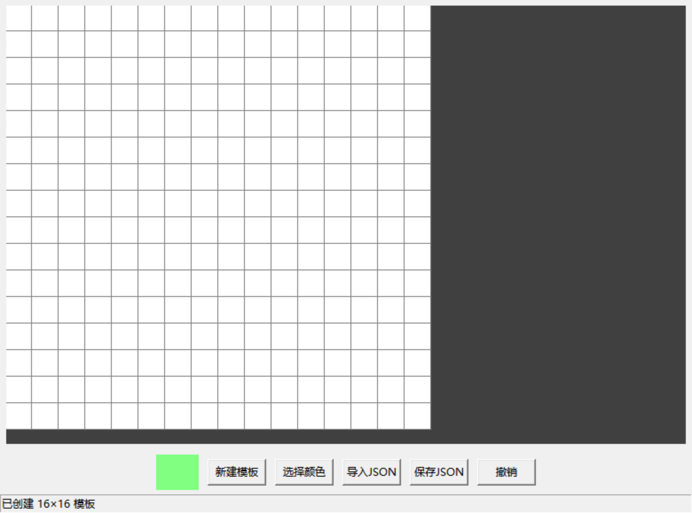

我们还可以在已有的 `JSON` 文件上进行修改，点击 `导入JSON` 选项：

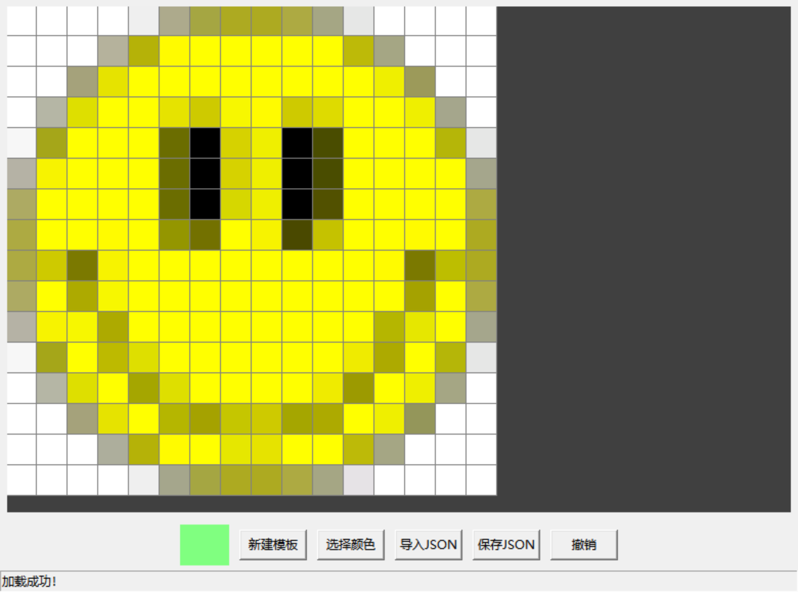

这里，我们导入之前转换过来的笑脸图案，进行描边：


接着，点击**保存 JSON** 即可，选择帧播放器播放修改后的文件，可以看到保存成功：

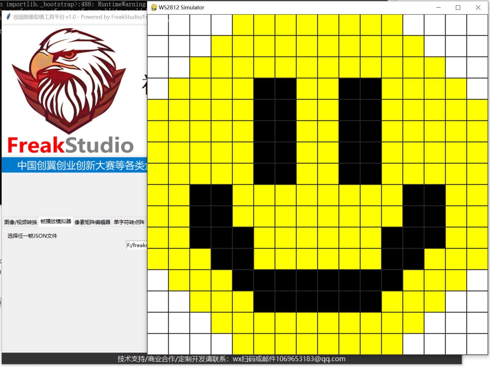

## 5.2 命令行工具

运行方式有两种：

- **源码运行**：`python cli_app.py [命令] [参数]`；
- **打包后运行**：`dist/NeopixelMatrixTool_v1.0/cli_app.exe [命令] [参数]`。

核心命令如下所示：

```sql
# 查看帮助（所有命令与参数说明）
python cli_app.py --help

# 图像转点阵 JSON（宽度24，高度16，输出至out/）
python cli_app.py convert -i test.png -o out -W 24 -H 16

# 单字符转点阵 JSON（可结合char_converter.py，输出至out/）
# 注：CLI可直接调用char_to_matrix函数，或通过GUI操作更便捷
# 视频转点阵 JSON（宽度24，高度16，提取30帧，输出至output/）
python cli_app.py convert -i test.mp4 -o output -W 24 -H 16 -f 30

# 播放视频帧 JSON（匹配output/下所有帧文件，帧率30）
python cli_app.py play -p "output/test_frame_*.json" -W 24 -H 16 --fps 30

# 预览图片/字符 JSON（单帧播放，路径为out/下的文件）
python cli_app.py play -p "out/test_char.json" -W 24 -H 16 --fps 30
```

## 5.3 设备端显示图像

这里，我们使用我们自己写的 `neopixel_matrix` 库，该库专为运行 `MicroPython v1.23.0` 固件的 MCU 设计，用于驱动 `WS2812` 像素矩阵，支持 `RGB565` 格式的 `JSON` 图像 / 视频帧数据解析、渲染与显示，同时提供布局适配、色彩校正、图像变换（翻转、旋转、滚动）等丰富功能。

有关这部分相关使用，可以查看仓库：

[https://github.com/FreakStudioCN/micropython-embedded/tree/main/middleware/display/neopixel_matrix](https://github.com/FreakStudioCN/micropython-embedded/tree/main/middleware/display/neopixel_matrix)

下面是一个简单的效果展示，这里我们使用树莓派 `Pico` 在 `16x16` 的 `WS2812` 点阵屏幕上进行测试：

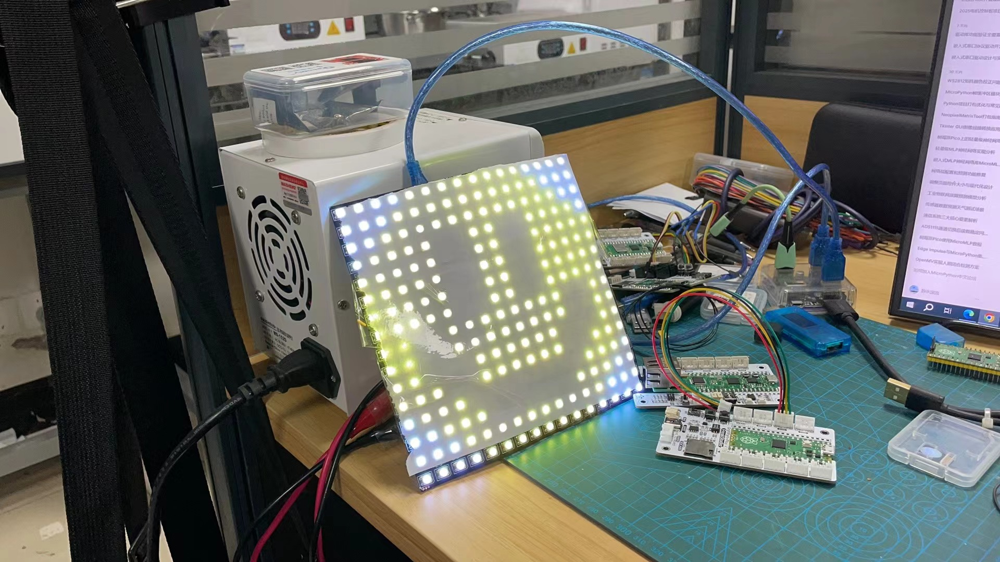

将 `WS2812` 矩阵的数据引脚 `DIN` 连接到 `MCU` 的 `GP6`，使用直流稳压电源进行 `5V` 供电：

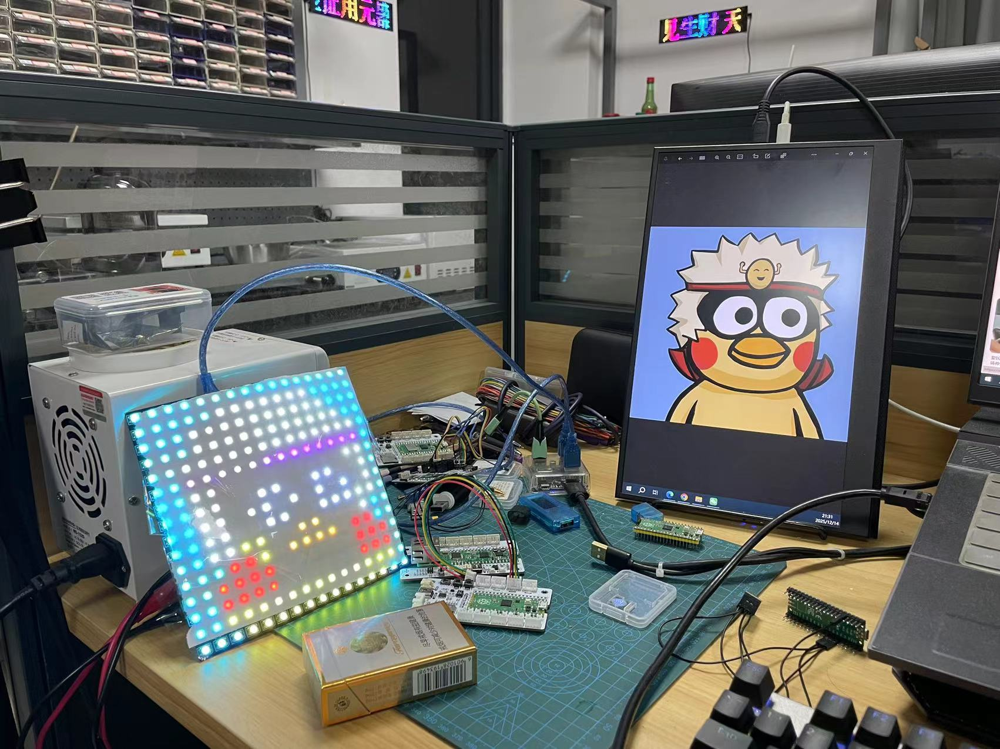

这里，在我们导入库文件后，将待显示的图片 `JSON` 文件和代码文件放到同一目录下，将所有文件烧录进去后：

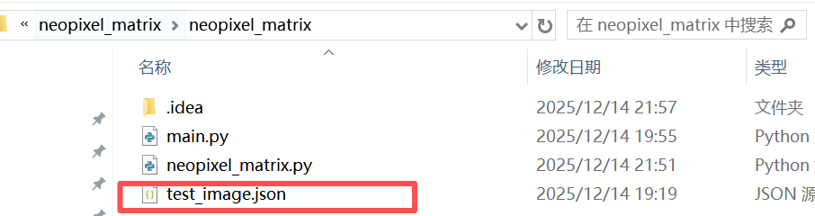

在 `REPL` 中运行下面的指令即可：

```
# 导入machine模块的Pin类，用于控制MCU的GPIO引脚
from machine import Pin
# 导入自研的NeopixelMatrix库，用于驱动WS2812像素矩阵
from neopixel_matrix import NeopixelMatrix

# 初始化WS2812矩阵对象
# 参数说明：
# 16, 16：矩阵的宽度为16像素，高度为16像素
# Pin(6)：MCU连接WS2812数据引脚的GPIO6
# layout=NeopixelMatrix.LAYOUT_SNAKE：矩阵采用蛇形布局（奇数行反向）
# brightness=0.1：矩阵亮度设置为10%（范围0~1）
# order=NeopixelMatrix.ORDER_RGB：WS2812的颜色顺序为RGB
# flip_h=True：图像水平翻转显示
matrix = NeopixelMatrix(16, 16, Pin(6), layout=NeopixelMatrix.LAYOUT_SNAKE, brightness=0.1, order=NeopixelMatrix.ORDER_RGB, flip_h=True)

# 用黑色（0对应RGB565的COLOR_BLACK）填充整个矩阵，清空屏幕
matrix.fill(0)
# 刷新屏幕，将填充的黑色显示到WS2812矩阵上
matrix.show()

# 从JSON文件加载RGB565格式的图像数据，偏移量x=0、y=0（图像左上角对齐矩阵左上角）
matrix.load_rgb565_image('test_image.json', 0, 0)
# 刷新屏幕，将加载的图像显示到WS2812矩阵上
matrix.show()
```

# 六、常见问题

1. **运行时提示 “字体文件未找到”：**

- **原因**：`assets/` 目录下缺少 `simhei.ttf` 字体文件，或路径配置错误。
- **解决方案**：

  - 将 `simhei.ttf` 字体文件放入 `assets/` 目录；
  - 检查代码中 `get_default_font()` 函数的字体路径是否正确。

1. **打包后运行提示 “资源文件（Logo / 二维码）缺失”：**

- **原因**：spec 文件中 `datas` 配置未正确引入 `assets/` 或 `docs/` 目录。
- **解决方案**：修改 spec 文件中的 `datas` 配置，例如：`datas=[('G:\\NeopixelMatrixTool\\assets', 'assets'), ('G:\\NeopixelMatrixTool\\docs', 'docs')]`，确保源路径为本地实际目录路径。

1. **运行时出现 “ModuleNotFoundError: No module named 'xxx'”：**

- **原因**：依赖库未安装，或打包时未包含隐藏导入的模块。
- **解决方案**：

  - 执行 `pip install xxx` 安装缺失的库；
  - 若为打包后问题，在 `spec` 文件的 `hiddenimports` 中添加该模块（如 `hiddenimports=['cv2', 'numpy']`）。

1. **模拟器无法播放帧数据，提示 “无帧文件”：**

- **原因**：`JSON` 帧文件路径匹配错误，或帧文件命名不符合规则；若为单帧（图片 / 字符），则仅显示单帧，空格键无播放效果。
- **解决方案**：

  - 视频帧：使用通配符匹配 `output/` 下所有帧文件（如 `output/test_frame_*.json`）；
  - 单帧：直接指定 `out/` 下的单个 JSON 文件路径（如 `out/test_char.json`），正常显示单帧即可。

1. 中文显示乱码或无法显示

- **原因**：缺少中文字体，或文件编码未设置为 `UTF-8`。
- **解决方案**：

  - 确保 `assets/` 目录下有 `simhei.ttf` 中文字体；
  - 所有代码文件头部添加 `# -*- coding: utf-8 -*-`，`JSON` 文件保存时使用 `UTF-8` 编码。

1. 转换视频时进度条无变化，或提示 “视频无法读取”

- **原因**：`OpenCV` 无法解析视频格式，或视频文件损坏，生成的帧文件未写入 `output/`。
- **解决方案**：

  - 转换视频格式为 `MP4`（推荐）；
  - 检查视频文件是否完整，或重新安装 `opencv-python`（`pip install --upgrade opencv-python`）；
  - 确认 `output/` 目录有写入权限，若没有则手动创建该目录。

1. 图片 / 字符转换后，`JSON` 文件未出现在 `out/` 目录

- **原因**：`out/` 目录未创建，或程序无写入权限。
- **解决方案**：

  - 手动在项目根目录创建 `out/` 目录；
  - 以管理员权限运行程序，确保目录有写入权限。

# 版本记录

| **版本号** | **修改人员** | **时间**   | **内容**                                                                             |
| ---------- | ------------ | ---------- | ------------------------------------------------------------------------------------ |
| v1.0.0     | 李子圣       | 2025/12/11 | 初始版本，实现核心功能：图像 / 视频 / 字符转点阵、可视化编辑、仿真播放、双界面支持。 |
| v1.0.1     | 李子圣       | 2025/12/15 | 优化目录结构：新增 docs/目录和许可证文件；补充了相关注释。                           |

# 开源协议

采用 `MIT License`：`MIT` 协议是一种宽松的开源协议，允许任何人自由使用、修改、分发本软件（包括商业用途），只需保留版权声明和协议声明即可。本协议不承担软件使用过程中的任何责任，软件以 “现状” 提供。
